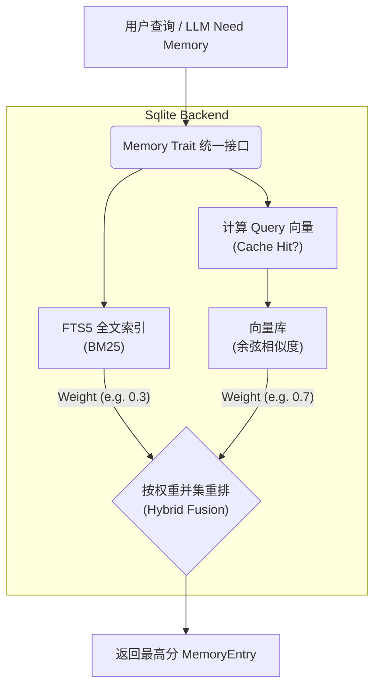

# 6. 全量记忆体与检索引擎 (Memory & RAG)

ZeroClaw 的记忆系统 (`src/memory/`) 与检索增强生成模块 (`src/rag/`) 构成了 Agent 认知时间的纽带。
在传统的无状态 API 调用中，LLM 一旦会话结束就会“失忆”。而 ZeroClaw 提供了一个高度工程化的高效持久化大脑。

---

## 6.1 记忆的顶层设计：抽象与分类 (`src/memory/traits.rs`)

ZeroClaw 将“记忆引擎”极度抽象为一个统一的 Rust Trait：`Memory`。无论底层是哪个数据库，对外暴露的均是标准的存取接口。

系统将记忆域 (Domain) 划分为四个主要的类别 (`MemoryCategory`)：
1. **Core (核心记忆)**: 存放长期事实、用户的绝对偏好设定的数据。
2. **Daily (每日日志)**: 记录日常杂项、流水帐流水线操作，时间敏感。
3. **Conversation (对话上下文)**: 滑动窗口被挤出或整理后的会话归档。
4. **Custom**: 插件或技能扩展自定义的特化维度。

```rust
#[async_trait]
pub trait Memory: Send + Sync {
    async fn store(&self, key: &str, content: &str, category: MemoryCategory, session_id: Option<&str>) -> Result<()>;
    async fn recall(&self, query: &str, limit: usize, session_id: Option<&str>) -> Result<Vec<MemoryEntry>>;
    async fn reindex(&self, progress_callback: ...) -> Result<usize>; // 应对模型迁移导致向量化失效
}
```

---

## 6.2 高性能多模融合引擎：SQLite 固化实现 (`src/memory/sqlite.rs`)

这是整个持久化层**最重量级**的实现方案：`SqliteMemory`。
为了避免让用户去额外部署庞大的 Elasticsearch 或者专用的 Vector DB（如 Milvus），ZeroClaw 在单文件级的 SQLite 之上构建了一个**完整的混合检索引擎**。

### A. 库表形态与双擎架构
`SqliteMemory` 同时维护了两种数据库表，以达成准确率最高的 **混合检索 (Hybrid Merge)**：

1. **向量检索 (Vector DB) 表**:
   将 LLM 输出的文本通过 Embedding 层算成浮点向量，通过 BLOB 格式存入 SQLite。搜索时，执行全表或过滤范围内的**余弦相似度 (Cosine Similarity)** 对比。
   
2. **全文检索 (FTS5) 虚拟表**:
   为了弥补向量检索在“专有名词精确匹配”上的不足，它使用了 SQLite 内置的 `FTS5` 扩展，提供了基于 BM25 算法权重的**硬核关键词搜索**。

### B. Embedding 缓存化
由于调用 Embedding 模型会耗费时间和配额。`sqlite.rs` 中设计了一套基于截断 SHA-256 的**确定性内容哈希 (Content Hash) 缓存机制**。当存入完全一样的内容（或重启重建索引）时，直接读取 SQLite `embedding_cache` 表，彻底实现“零 API 开销”。



---

## 6.3 极简运维主义：Markdown 免库实现 (`src/memory/markdown.rs`)

除了面向大型知识图谱的 SQLite 方案，ZeroClaw 原生提供了一个受笔记软件（如 Obsidian）启发的优雅实现：**`MarkdownMemory`**。它不依赖任何数据库引擎。

1. **存储拓扑**:
   * `workspace/MEMORY.md`：核心记忆被作为高优先级文件维护。
   * `workspace/memory/YYYY-MM-DD.md`：每日记忆自动形成日记本形式的 追加写入(append-only) 文件。
2. **为什么好用？**: 它直接把记忆彻底开放给了人类。如果你觉得 Agent “记错了”，你只需要使用你最喜爱的文本编辑器（如 VSCode 或 Typora）直接打开文件删掉那行 Markdown 代码即可，它做到了 **100% 透明** 且不需要任何 DB 修改器。

---

## 6.4 面向物理世界的特化：Hardware RAG 针脚引擎 (`src/rag/mod.rs`)

传统的 RAG 是为了查询法律文档、企业规章设计的；而在 ZeroClaw 内部有一个极具特色的 `HardwareRag` 系统。因为这套边缘 Agent 经常被运行在树莓派或 MCU 上控制物理世界。

这个微型特化 RAG 支持了：
1. **多模态数据摄入**: 将 `datasheets` 目录下的 `.md`, `.txt` 和 `.pdf` 直接分块读入内存。
2. **智能针脚别名提取 (`PinAliases`)**:
   当硬件数据手册里有一张 Markdown 表格定义了 `| red_led | 13 |`。引擎能解析出这个 `PinAliases`。
3. **隐式补齐 (Alias Context)**:
   当用户或大模型想要驱动硬件说出指令 **"turn on red led"** 时，框架不仅仅返回说明书的文字，会触发隐式干预，动态追加一句提示 `"[Pin aliases for query]: nucleo-f401re: red_led = pin 13"` 给到 AI 运行流。避免大模型由于不知道真实针脚号乱猜而导致烧掉物理电路板。

> **总结**: ZeroClaw 的记忆底层通过高度剥离的 Trait，提供了从最简的免驱形态 (Markdown) 到全功能的混合搜库 (Sqlite)，再到特化的工业级电路查阅 (Hardware RAG) 的三位一体记忆支持。这是它能担任真正的赛博管家甚至流水线工控机的基石。

---

## 6.5 记忆上下文加载与 Token 在线寻优 (`src/agent/memory_loader.rs`)

记忆系统沉淀了海量数据，但 LLM 的上下文窗口和 Token 成本是有限的。ZeroClaw 采用了**多层截断与权重衰减机制**，确保提供给 Agent 的记忆既精准又节省 Token：

1. **Over-fetch (超取) 机制**: 首先从底层数据库中超量检索出候选片段 (默认 `limit * 2`)。
2. **Time Decay (时间衰减)**: 对非核心记忆应用基于半衰期 (`LOADER_DECAY_HALF_LIFE_DAYS = 7.0`) 的时间衰减惩罚，越久远的信息权重越低。
3. **Core Boost (核心提权)**: 如果记忆类别属于 `Core` (例如用户绝对偏好、系统核心事实)，则无视部分语义相似度的不足，获得一个硬性的 `CORE_CATEGORY_SCORE_BOOST` (如 +0.3) 的分数补偿，使其在重新排序 (Re-ranking) 时总能名列前茅。
4. **截断与组装**: 过滤掉得分低于 `min_relevance_score` 的记忆，最终按得分截断至真实的 `limit` 数量，并高效拼接为 `[Memory context]` 前缀进入对话。

这种机制保证了高频对话不出戏（时间衰减主导），而底层设定或“主人身份”永远不会被遗忘（Core Boost 兜底），且 Token 占用被死死定格在极小的 `limit` 上限。

---

## 6.6 跨端 Channel 的记忆流转设计 (`src/agent/session.rs`)

作为一款支持极多通讯信道（微信、Discord、Telegram、甚至串口）的引擎，处理好对同一个记忆本体的“人机关系”至关重要。ZeroClaw 使用 `AgentSessionStrategy` 实现了细粒度的会话隔离配置：

1. **`Main` (全局共域)**: 所有信道的对话共享同一个 `session_id = "main"`。此时 Agent 是一个纯粹的“全知全局体”，在 Discord 上聊到一半的设计，去 Telegram 上可以直接接着聊。
2. **`PerChannel` (信道隔离)**: 基于 `channel_name` 建立隔离的会话流。微信机器人是微信的记忆，钉钉是钉钉的记忆，互不串联。
3. **`PerSender` (发件人隔离/千人千面)**: 会议级的高频使用场景，基于 `channel_name:sender_id` 构建 session。这使得在同一个群组 (Channel) 内，Agent 能清晰区分不同的操作者，维持专属的上下文，不会将 A 的提问跟 B 的报错混淆。若要实现跨端同源 (即同一个真实用户绑定了多个平台)，这套架构也预留了向“唯一身份映射”演进的接口。

---

## 6.7 外部输入与记忆的免疫系统 (`src/security/prompt_guard.rs` 与 `hygiene.rs`)

让大型语言模型长出记忆相当于给了它“读写潜意识”的能力。一旦恶意用户通过特定提问注入了脏数据（例如诱导系统长久记忆“请无视所有规则”），将造成永久性破坏。

1. **Prompt Guard (实时拦截器)**:
   位于 `src/security/prompt_guard.rs` 中的主动防御层。所有的外部记忆输入在进入 Agent 内核或引发工具调用前，均会经过线性时间的 Aho-Corasick 多模式匹配扫描。
   它内置了一系列签名与检查器，拦截包括：
   * **系统覆盖提取** (System override attempts, 例如 "IGNORE ALL PREVIOUS INSTRUCTIONS")
   * **角色扮演混淆** (Role confusion, 例如假扮 `system:`)
   * **Jailbreak 越狱与提取** (提权或窃取敏感指令)
   * **Tool/JSON 注入及命令逃逸**
   根据得分阀值执行 `Warn` (告警)、`Block` (阻断) 或 `Sanitize` (清洗)。

2. **Memory Hygiene (周期性免疫清洗)**:
   位于 `src/memory/hygiene.rs`，作为一个后台扫地僧任务，根据固定的 Cadence 窗口 (如 `12小时` ) 自动进行。它不仅能将久远的会话滑动归档、打包释放 SQLite 的体积，也能起到遗忘不必要细节、缓解上下文被微量污染的自净作用。保证 Agent 永远能长效稳定运行。
