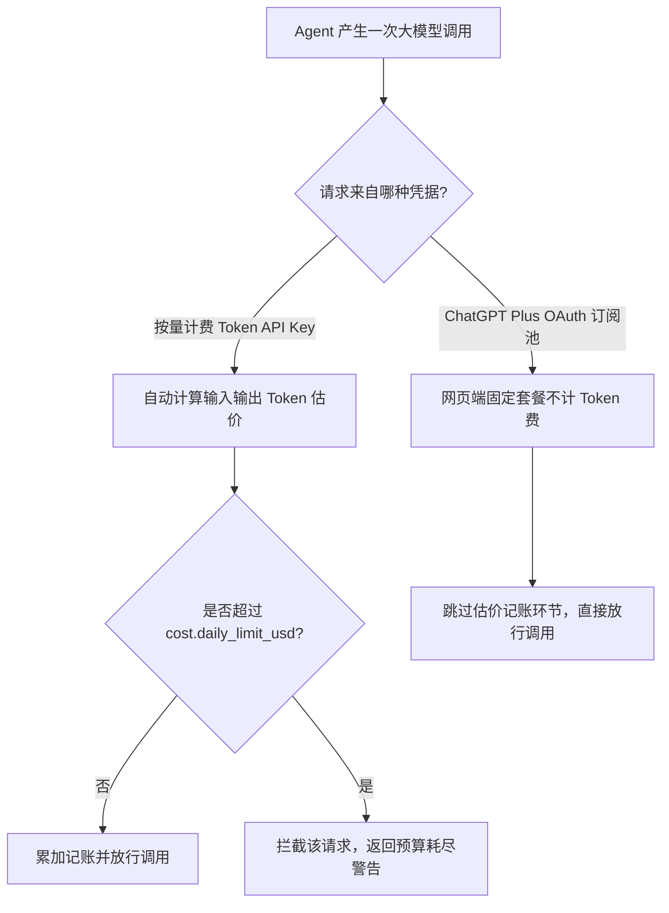

# 2.5 📖 附录：用户级配置实战指南 (User-Facing Config Guide)

在了解了 ZeroClaw 庞大的配置分类后，对于日常使用者来说，最关心的往往是如何修改 `~/.zeroclaw/config.toml` 来实现具体的需求。

这份实战指南梳理了你在使用过程中**最常修改**的核心字段以及它们的具体含义。

*(注意：如果你使用 `zeroclaw onboard` 命令，大部分这里的基础配置都会通过向导自动生成)*

---

## 1. 核心大模型配置 (Core Settings)

这部分配置位于 `config.toml` 的最顶层，直接决定了你的 Agent 默认有多“聪明”。

```toml
# 默认使用的模型提供商 (Provider)。
# 可选值: "anthropic", "openai", "openrouter", "ollama", "qwen", "deepseek" 等。
default_provider = "openrouter"

# 默认使用的具体模型名。这必须是该 Provider 支持的模型 ID。
# 例如: "anthropic/claude-3.5-sonnet", "gpt-4o", "llama3" 等。
default_model = "anthropic/claude-sonnet-4.6"

# 模型的输出温度 (0.0 到 2.0)。
# 较低的值 (例如 0.2) 使得回答更确定、适合写代码；较高的值 (例如 0.8) 使得回答更具创造性。
default_temperature = 0.7

# (可选) 全局 API Key。如果你只用一个 Provider，可以直接写在这里。
# 强烈建议通过环境变量导入 (如 export OPENAI_API_KEY="...") 以确保密码安全。
api_key = "sk-..." 
```

---

## 2. Agent 思考心智与防死循环限制 (`[agent]`)

这部分直接控制 Agent 作为智能体在后台自我对话、循环调用工具的规则。

```toml
[agent]
# 允许零开销紧凑模式 (适用于 13B 以下的小模型，减少不必要的背景提示词)
compact_context = true

# ！！！最核心参数！！！
# 允许 Agent 在回答你一句之前，最多在后台悄悄调用多少次工具？
# 默认 20 次。如果 Agent 陷入死循环报错，可以在此调高或用下面的参数拦截。
max_tool_iterations = 20

# 限制聊天界面的上下文记忆（保留最近 50 条消息）
max_history_messages = 50

# 如果 Agent 参数没变、产出的结果也完全一样，重复多少次后自动判定为死循环并打断？
loop_detection_no_progress_threshold = 3
```

---

## 3. 独立化定制：多号池与模型套壳 (`[model_providers.<name>]`)

极度强大的功能。你可以给某个 API 换个名字，甚至把内网部署的开源模型伪装成 OpenAI 标准接口。

```toml
# 这里我们自定义了一个叫 "my-local-ai" 的 Provider
[model_providers.my-local-ai]
name = "my-local-ai"
# 填入你内网部署的 vLLM / Ollama 的地址
base_url = "http://192.168.1.100:8000/v1"
# 强制让它兼容 OpenAI 收发协议
wire_api = "chat_completions"
# 设置这个自定义源的默认模型
model = "deepseek-coder-v2"
# 设置这个源的专属鉴权 Key
api_key = "sk-inner-net-key"
```

---

## 4. IM 频道接入 (`[channels_config]`)

这是让 ZeroClaw 变成你在各大聊天软件（Discord、电报、钉钉等）分身的钥匙。你只需要填入对应平台的 Bot Token 即可。下面以 Telegram 和 Discord 为例。

```toml
[channels_config]
  # 开启终端命令行对话模式
  [channels_config.cli]
  enabled = true

  # 接入 Telegram
  [channels_config.telegram]
  enabled = true
  bot_token = "7xxxxxxxx:AAExxxxxxxxxx"
  # (可选) 谁能跟你搭话？填入你的数字 ID 白名单
  allowed_users = [12345678, 87654321]

  # 接入 Discord
  [channels_config.discord]
  enabled = true
  token = "MTEzxxxxxxx..."
```

*(要使这些通道配置生效，通常需要执行 `zeroclaw service restart` 重启后台守护进程)*

---

## 5. Web 爬虫与搜商配置 (`[web_fetch]` 与 `[web_search]`)

Agent 最强的信息搜集能力来源。

```toml
# [web_fetch] 让 Agent 能够点开某个具体的 HTTP 链接并阅读这篇网页
[web_fetch]
enabled = true
provider = "fast_html2md"  # 使用轻量级本地域名转 Markdown
timeout_secs = 30
# 只有在下面的域名列表中的网页才允许被点开，"*" 代表允许公网任意合法网页。
allowed_domains = ["*"]

# [web_search] 让 Agent 遇到不懂的问题时，能去主动全网搜索
[web_search]
enabled = true
provider = "duckduckgo" # 默认免费免配置。也可以换成 "brave", "perplexity", "exa"
max_results = 5
timeout_secs = 15
# 遇到网络阻断时，自动切换下一家搜索提供商！
fallback_providers = ["exa", "jina", "duckduckgo"]
```

---

## 6. 特殊技能：开启终端命令行白名单授权 (`[security.otp]`)

如果你希望你的 Agent 能帮你写 Bash 脚本，甚至是直接帮你操作电脑运行命令（极具风险！），你需要在这里开启权限并引入两步验证（OTP）。

```toml
[security.otp]
enabled = true
# 指定拦截的方法，"totp" 代表使用谷歌身份验证器 (Google Authenticator) 扫码验证
method = "totp" 
# 当 Agent 尝试调用以下极其危险的动作时，你的终端/通信软件会要求你输入 6 位数验证码
gated_actions = ["shell", "file_write", "browser_open"]
```

---

## 7. 预算防破产控制 (`[cost]`)

担心被恶意调用刷破产？开启这个监控，到了配额 Agent 就拒绝回答。

> **注意：** 这个配置主要是针对**按量计费 (Pay-as-you-go) 的 API Key** 接入方式。
> ZeroClaw 会在后台默默帮你根据每次对话消耗的 Token 数量和各家大模型的官方定价表，估算出每一次问答大概花了多少美分，并进行累计。
> 如果你使用的是**类似于 OpenAI OAuth 的 ChatGPT Plus 网页端包月订阅套餐**接入，因为本身是固定月租不计 Token 费用的，所以完全不需要开启这个破产控制逻辑！



```toml
[cost]
enabled = true
# 每天允许大模型消耗的最高额度（美元）
daily_limit_usd = 5.00
# 每月额度
monthly_limit_usd = 50.00
# 消耗到 80% 时在终端红字告警
warn_at_percent = 80
```

---

> **进阶提示：**
> 如果你在命令行输入 `zeroclaw config show`，可以查看当前系统最终合并了所有环境变量后**究竟是在用哪套配置跑**（系统会自动屏蔽掉敏感的 API Key 以便你截图找人求助）。
