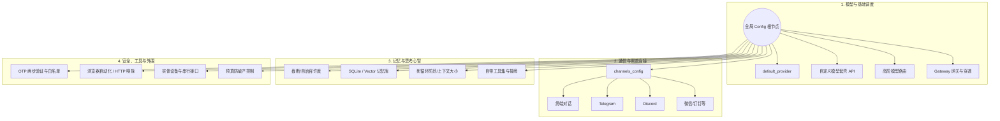
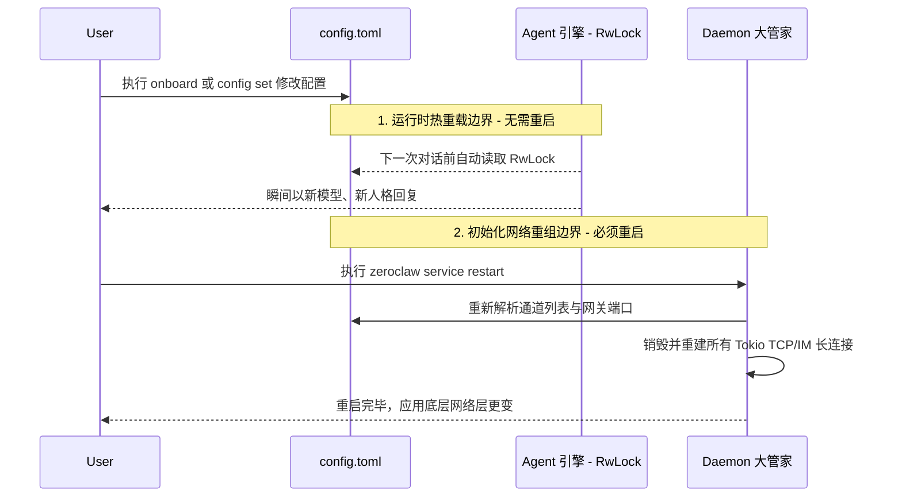

# 2. ⚙️ 配置中心与架构 (Configuration & State)

在了解了 ZeroClaw 如何启动之后（引导、守护进程、网关），在真正进入 Agent 核心引擎前，我们必须要了解它是如何被**配置**的。

ZeroClaw 拥有一个极其庞大且细致的配置系统。大到使用哪个大模型，小到代理服务器、心跳频率、甚至是经济体系运作逻辑，全都在一个统一的架构下进行管理。

> **源码核心位置**: `src/config/schema.rs` 与 `src/config/mod.rs`

## 2.1 配置文件在哪？

ZeroClaw 在寻找配置时，采用的是类似跨平台应用标准的**级联读取 (Cascade Reading)** 策略，优先级从高到低依次是：

1. **绝对路径环境变量**: 如果你设置了 `ZEROCLAW_WORKSPACE` 环境变量，它将强制读取该路径下的 `config.toml`。
2. **工作空间锚点**: 如果当前运行目录下存在一个名为 `active_workspace.toml` 的文件，它会读取里面的指向路径。
3. **默认主目录**: 如果以上都没有，系统默认会去用户的家目录读取：`~/.zeroclaw/config.toml`。

除了配置文件，很多关键能力（比如具体 Provider 的 API Key，如 `OPENAI_API_KEY`, `ANTHROPIC_API_KEY` 等）可以直接通过**环境变量**注入，此时环境变量的优先级高于配置文件的静态文本。

---

## 2.2 核心配置全览 (`Config` Struct)

如果你打开 `src/config/schema.rs`，你会看到一个巨大无比的 `Config` 结构体。为了方便理解，我们可以将这几十个配置项划分为以下**四大核心板块**：

### 板块一：模型与基础调度 (Models & Routing)
这部分决定了 Agent 的智商上限和调用方式。
* `default_provider` / `default_model`：全局默认的大模型底座（比如 `anthropic` 和 `claude-3-5-sonnet`）。
* `model_providers`：你可以自己定义兼容 OpenAI 协议的私有模型端点。
* `model_routes` / `embedding_routes`：**高阶路由！** 你可以依据需要，要求“凡是以 `hint:coding` 打头的请求，强制路由到 Qwen-Coder”，或者“翻译请求走 DeepSeek”。
* `gateway` / `tunnel`：定义网关监听的端口，以及是否开启 `Ngrok` / `Tailscale` 公网穿透。

### 板块二：通信与渠道连接 (Channels)
这部分决定了机器人能在哪些地方上班聊天。
* `channels_config`：这是所有 IM 体系的聚合。包含了 `telegram`, `discord`, `slack`, `mattermost`, `wechat` (微信), `qq`, `dingtalk` (钉钉) 等几乎所有主流平台的接入凭据配置。

### 板块三：Agent 的记忆与思考心智 (Autonomy & Memory)
这部分是区别普通脚本与“智能体”的关键。
* `autonomy`：定义了机器人有多大的“自主权”。例如，如果置信度达到 90% 是否允许自动执行 Linux 命令而无需询问用户。
* `memory`：记忆后端配置。支持 `sqlite`, `lucid` (本地高性能), `markdown` (平文本) 等，它决定了机器人的长短时记忆如何存储。
* `agent` & `coordination`：定义了多智能体（Delegate Agents）协作时的流转逻辑和上下文长度限制。
* `research` & `skills`：定义了机器人在遇到不懂的问题时，能多大概率触发自我搜索（ResearchPhase），以及它能装载多少个第三方技能包（Skills）。

### 板块四：安全、工具与外围 (Security & Peripherals)
这部分决定了机器人的手伸得有多长，以及怎么防范它的风险。
* `security`：包含急停开关（Estop）保护策略、域名访问白名单等。
* **各色具体工具配置**：
  * `browser`：浏览器控制自动化参数。
  * `http_request` / `web_fetch`：爬虫与网页嗅探配置。
  * `composio`：外部强授权三方工具集成。
  * `mcp` (Model Context Protocol)：MCP 外挂服务器连接配置。
* `hardware` / `peripherals`：如果你是在跑一个硬件实体机器人，这里配置了串口（Serial / Probe）和机械部件参数。
* `economic` / `cost`：成本追踪，你可以给你的 Agent 设定一个 token 消费预算，甚至让它模拟一种经济扣费生存模式！

---

## 2.3 热重载 (Hot-Reloading) 机制

在上一章我们提到过 `zeroclaw onboard` 这个命令。配置系统最强大的一点在于它的**热插拔能力**：

并非所有的配置修改都需要关闭并重启 Daemon：
1. **即时生效的逻辑**：像 `autonomy`（拦截策略）、`model_routes`（模型路由）、甚至是 `SOP` 流程节点的修改，ZeroClaw 的架构采用了 `RwLock` 或 `Arc` 并在关键调用前重新读取（或者依赖 File Watcher），实现**无需重启、即改即生效**的魔术体验。
2. **必须重启的基建**：对于涉及到长连接建立的配置（如改了 Gateway 端口，或新增了 Telegram Bot 的 Token 被 Daemon Supervisor 管理），则必须通过执行 `zeroclaw service restart` 来触发底层连接重组。

正是因为这套“配置即一切”且包含强力热插拔基因的架构，接下来我们在探索 **Agent 核心引擎** 时，你就会明白为什么 Agent 可以根据不同的场景（如写代码还是作图）瞬间切换到截然不同的人格和工具链里去了。
