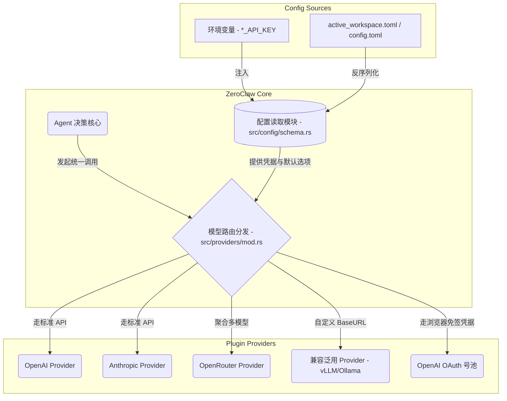
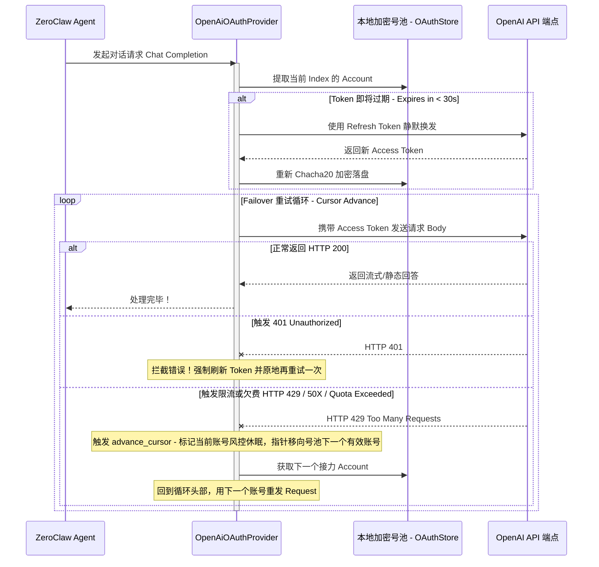

# 4. 大模型接入层与配置池 (Providers & Config)

ZeroClaw 的大模型（LLM）接入层采用了**基于 Trait 的插件化架构**。这使得无论是云端 API 还是本地大模型，都能以统一的接口（如流式返回、Function Calling）接入系统核心引擎。

相关源码位置：`src/providers/` 和配置层 `src/config/schema.rs`。

---

## 4.1 支持的 LLM 厂商概览

ZeroClaw 原生支持众多主流模型厂商（在 `src/providers/mod.rs` 中进行路由和工厂注册）：

*   **国际主流平台**:
    *   OpenAI (`openai`, `openai_codex`)
    *   Anthropic Claude (`anthropic`)
    *   Google Gemini (`gemini`)
    *   AWS Bedrock (`bedrock`)
    *   OpenRouter (`openrouter` - ZeroClaw 默认的路由提供商)
    *   GitHub Copilot (`copilot`)
*   **本地部署模型**:
    *   Ollama (`ollama`)
*   **国内大语言模型集成** (内置了完整的别名解析机制):
    *   阿里通义千问 (`qwen`, `dashscope`)
    *   智谱 GLM (`glm`, `zhipu`)
    *   月之暗面 Kimi (`moonshot`, `kimi`)
    *   MiniMax (`minimax`)
    *   字节豆包 (`doubao`, `ark`)
*   **通用协议兼容 (`compatible` 模块)**:
    *   只要提供并兼容 OpenAI `/v1/chat/completions` API 的任何推理框架（如 vLLM, LM Studio 等），都可以通过该模块无缝接入。

---

## 4.2 LLM 的灵活配置体系

ZeroClaw 采用了声明式配置以及 12Factor 环境变量双重支持。
以下是 ZeroClaw 接入层与配置系统的架构关系统系图：



### A. 配置文件 `config.toml`（推荐方式）
通常位于工作区根目录的 `active_workspace.toml` 或主目录下的 `~/.zeroclaw/config.toml`。

**全局基础配置示例：**
```toml
default_provider = "openrouter"
model = "anthropic/claude-3-5-sonnet"
api_key = "sk-xxxxxx" 
api_url = "https://openrouter.ai/api/v1" # 用于覆盖默认的 Base URL 或内网地址
default_temperature = 0.7
```

**多模型路由与自定义 Profile：**
通过 `model_providers` 块，可以为一个复杂的 Agent 系统定义成百上千个独立的接入配置（例如路由给专门的 Coding Agent 和普通的 Chat Agent 用不同的配置）：
```toml
[model_providers.my_local_llama]
name = "compatible" 
base_url = "http://127.0.0.1:11434/v1"
```

### B. 环境变量 (Env Vars)
支持各厂商的标准环境变量（例如 `OPENAI_API_KEY`, `ANTHROPIC_API_KEY`）以及 ZeroClaw 统一的 `ZEROCLAW_API_KEY`，极大地简化了 Docker 镜像和容器云的无状态注入。

---

## 4.3 深挖扩展：OpenAI OAuth 多号池与高可用 Failover（⚠️ Fork 自研扩展）

> [!IMPORTANT]
> **本节内容来自本项目的 Fork 自研扩展，并非 ZeroClaw 官方上游功能。**
>
> 官方上游 (`src/auth/openai_oauth.rs`) 仅实现了标准的 **PKCE + Browser/Device Code 单账户授权流程**，用于获取并存储 Token 供 CLI 本地使用，没有多账号号池、没有 Chacha20 自定义加密存储和 Failover 自动切换功能。
>
> 本节描述的以下能力均为 Fork 中新增/修改的实现：
> - `src/providers/openai_oauth.rs`（完整的 OAuth Provider 接入）
> - `src/oauth/store.rs`（多号 Chacha20 加密存储池）
> - `advance_cursor()` Failover 切换逻辑
>
> **官方上游支持计划**：从现有 GitHub Issue/PR 来看，官方目前尚无公开的多账号号池路线图。Gemini OAuth 已于近期被合并到 `src/auth/` 中（含 `gemini_oauth.rs` 与统一 OAuth 工具类 `oauth_common.rs`），说明官方在持续完善 OAuth 基础框架，但 "Provider 层的多账号 Failover" 属于更高阶的应用层能力，短期内是否会官方化尚无公开讨论。

在 Fork 版的 `src/providers/` 目录下，扩展实现了一个生产级、企业级的高可用接入层：**`openai_oauth.rs`**。
这一扩展解决了：在没有购买纯 API Key 时，如何利用官方 ChatGPT Plus/Pro/Free 账号的 OAuth 鉴权，实现稳定、高可用的 API 调用，并自带多号防风控切换功能。

### 4.3.1 OAuth 授权与多号录入 (`src/oauth_cli.rs` & `src/oauth/openai_login.rs`)

执行命令 `zeroclaw oauth login --provider openai` 的底层微观流程：
1.  **启动本地回调服务**：建立短暂的 HTTP Server (默认监听 `127.0.0.1:1455`)。
2.  **拉起浏览器**：在桌面端自动调起浏览器访问 OpenAI 授权端点。
3.  **拦截 Token**：用户同意授权后，浏览器重定向回本地，换取完整 OAuth 载荷（`access_token`, `refresh_token` 等）。
4.  **安全入库**：通过 `store.add_openai_account(...)` 将提取的账号存入配置池文件中。

### 4.3.2 凭据的多号池存储引擎 (`src/oauth/store.rs`)

*   **存储位置**: 位于 `~/.zeroclaw/oauth/openai_accounts.toml`。
*   **追加模式 (Append)**：每次调用 `login` 都会在 TOML 的 Array 中追加一个账号对象。构成了多号的弹药库。
*   **AES256 加密静息态 (SecretStore)**：最亮眼的设计。ZeroClaw **绝对不会**将 OAuth Token 明文存放在磁盘上。由于这属于超级敏感凭证，系统会在将其序列化落盘前，使用核心包封装的基于 Chacha20Poly1305 算法的 `SecretStore` 加密，确保哪怕配置被拷贝也无法劫持 Token。

### 4.3.3 Agent 运行时的全自动轮转与智能 Failover (`src/providers/openai_oauth.rs`)

当配置文件指定 `default_provider = "openai-oauth"` 或命令行传入指定接入方时，多号池的强大能力将在这一刻展现。
以下是这个自带中间件能力的 Provider 如何在发包时进行错误拦截与重试的流程图：



1.  **解密与装载 (Pooling)**：从 `store.load_openai_runtime_accounts()` 加载并解密所有状态为启用的 OAuth 号，构建运行时的 `Vec<oauth::OpenAiOAuthRuntimeAccount>` 池。
2.  **静默无感续期 (Auto-refresh Token)**：发包前，如果检测到当前使用的 `access_token` 将在 30 秒内过期，底层会静默地向 OpenAI 申请换发并发起落盘更新。对业务层代码 100% 透明。
3.  **401 抢救机制**：如果是突发的 HTTP 401，拦截错误、强制刷新 Token、然后拿着合法的 Request 帮用户**重发一遍**。
4.  **智能限流容灾 (Failover / cursor advance)**：
    *   如果遭遇 HTTP 429 Too Many Requests, 502 Bad Gateway，或者 Body 包含 `insufficient_quota` (配额耗尽)。
    *   在 `openai_oauth.rs` 中，有一个经典的函数 `advance_cursor`。程序会自动将当前请求的轮询索引 `index + 1`。
    *   **无缝将出错的请求投递给池子里的下一个 OpenAI 账号**，直到成功或者全部耗尽才会向外抛出 Err。

> **总结**: ZeroClaw 的接入层并非仅仅完成了“发一个 HTTP Post 请求”这么简单。它对于特定厂商的封装达到了企业级中间件的标准，原生的限流退避、自动容灾、安全加密存储使得它可以胜任长时间运行的强健生产级 Agent。

### 4.3.4 号池的底层数据结构与加密模型

在 `oauth/store.rs` 中，定义了这个高度安全的“号池”的数据结构。文件落盘时，它的标准面貌是一个包含了**顶层版本号**和**账号数组 (Array of Tables)** 的 TOML 文件。

#### A. TOML 文件的结构

```rust
struct OAuthStoreFile {
    version: u32,                                // 版本号，当前硬编码为 1
    openai_accounts: Vec<StoredOpenAiOAuthAccount>,  // 一个包含多账号的数组 (号池)
}
```

#### B. 数据安全层级切分

一个账号 (`StoredOpenAiOAuthAccount`) 在序列化时，严格区分了**明文**和**密文**：

```rust
struct StoredOpenAiOAuthAccount {
    // ---- 账号标识 (明文) ----
    id: String,              // UUID，例如: 550e8400...
    name: String,            // 用户易读别名，通常是从 JWT 提取出的 Email
    enabled: bool,           // 开关，如果设为 false，Agent 轮询时会跳过
    authorize_url: String,   // OAuth 授权跳转 URL
    token_url: String,       // 换取/刷新 Token 的 API URL
    client_id: String,       // 执行 OAuth 的客户端 ID
    scope: String,           // OAuth 权限范围

    // ---- 核心敏感凭据 (🌟 全部经过 AES-GCM/Chacha20 密文加密) ----
    client_secret: Option<String>,  
    id_token: Option<String>,       
    access_token: String,           // (密文) 最核心的调用凭证！
    refresh_token: Option<String>,  // (密文) 用于后台无感续期的令牌！
    openai_api_key: Option<String>, 

    // ---- 时间戳与元数据 (明文) ----
    expires_at: Option<String>, // access_token 过期时间 (RFC3339)
    created_at: String,         
    updated_at: String,         
}
```

#### C. 落盘后的真实文件样貌

正因为底层极其关注安全 (Secure by design)，如果你用文本编辑器打开 `~/.zeroclaw/oauth/openai_accounts.toml`，你看到的**绝对不是**裸露的 Token：

```toml
version = 1

[[openai_accounts]]
id = "9bd11026-64c8-47e0-b6e2-57fa2cd2f7c0"
name = "my-pro-account@gmail.com"
authorize_url = "https://auth.openai.com/oauth/authorize"
token_url = "https://auth.openai.com/oauth/token"
client_id = "app_EMoamEEZ73f0CkXaXp7hrann"
scope = "openid profile email offline_access"

# 注意：核心 Token 被 chacha20poly1305 加密成了乱码！
# 即便文件泄露，没有本机的衍生硬件环境密钥也无法解密！
access_token = "M4bXjQ3T1jVp0G2g...[极长的乱码密文]..."
refresh_token = "Q8zL3P4xR2mA9bC...[极长的乱码密文]..."

expires_at = "2026-03-01T22:30:15Z"
created_at = "2026-02-28T22:25:00Z"
updated_at = "2026-02-28T22:25:00Z"
enabled = true

# 多次执行 login，下方就会继续出现多组 [[openai_accounts]]
```

---

### 4.3.5 延伸对照：官方 OpenAI Codex CLI 的解法 (Keyring) 🔑

为了更深入理解系统级编程中的凭据存储艺术，我们特意查阅了同期的 OpenAI 官方开源项目 —— **Codex CLI** (`codex-rs`) 是如何处理这段逻辑的（见 Codex 源码 `rmcp-client/src/oauth.rs`）。

Codex 采取了另一种业界标准的做法：**基于操作系统的 Keyring（凭据管理器）**。

1.  **存储策略三连 (`OAuthCredentialsStoreMode`)**：
    Codex 定义了三种模式：`Auto` (默认), `File`, `Keyring`。
2.  **默认走硬件 / OS 级密保 (`KeyringStore`)**：
    在 `Auto` 模式下，Codex 会默认尝试调用底层操作系统的 Keychain 机制（通过 Rust 的 `keyring` crate）：
    *   **macOS**: macOS Keychain (钥匙串)
    *   **Windows**: Windows Credential Manager (凭据管理器)
    *   **Linux**: DBus-based Secret Service 或 Linux kernel keyutils
3.  **降级策略 (Fallback to File)**：
    只有当操作系统的 Keyring 服务不可用、或者因为环境问题（如 Docker 容器、无头服务器）报错时，Codex 才会降级将 Token 写到文件 `~/.codex/.credentials.json` 中。
    值得注意的是，Codex 的文件降级存储方案是**明文 (Plain text)**的，因此它通过代码在 Unix 系统下强制把文件权限设定为 `0o600`（仅当前用户可读写）来做基础防范：
    ```rust
    // Codex 源码片段
    let perms = fs::Permissions::from_mode(0o600);
    fs::set_permissions(&path, perms)?;
    ```

**对比总结：**
*   **Codex CLI**: 优先依赖操作系统的 Keychain，极其标准化。但在无状态服务器容器内部署时，通常会降级到**明文存储的 json 文件**，有文件被拖库窃取的风险。
*   **ZeroClaw**: 取消了对臃肿的 OS Keychain API 的依赖，采用**自带的 AES (Chacha20Poly1305) 跨平台加密**。无论是在 Mac 桌面还是 Docker Linux 容器里，落盘的永远是用机器环境熵派生出 Key 的乱码密文。这种 `SecretStore` 机制让它的全平台安全性表现得更一致，体积也更轻巧。

---

### 4.3.6 高阶技巧：拥抱开源生态 —— 将官方 Codex `auth.json` 零成本迁移至 ZeroClaw 🚀

刚刚我们提到了 Codex 会将凭据以 `auth.json` (明文格式) 落盘。
既然很多人已经在电脑上安装过 OpenAI 的官方应用并产生了 `~/.codex/auth.json`，**我们能否写一个简单的迁移脚本，直接提取官方凭证给 ZeroClaw 喂饭，实现“无感登录”？**

答案是：**完全可以，而且极其简单！**

我们看一下 Codex 源码 (`codex-rs/core/src/auth/storage.rs` 和 `token_data.rs`) 中定义的文件结构：

```rust
// 官方 Codex auth.json 结构
pub struct AuthDotJson {
    pub auth_mode: Option<String>,
    pub openai_api_key: Option<String>,
    pub tokens: Option<TokenData>,
}

pub struct TokenData {
    pub id_token: IdTokenInfo,      // 包含了 email 和 raw_jwt
    pub access_token: String,       // 核心 Token
    pub refresh_token: String,      // 刷新 Token 
    pub account_id: Option<String>,
}
```

对比我们在 3.3.4 小节剖析的 ZeroClaw 的 `StoredOpenAiOAuthAccount`，你会发现这两者的核心字段是**完美超集的一一映射**！

#### 零成本平替 (Migration) 的大致实现思路：

如果你要在 ZeroClaw 的启动流中加入一个“探测并挂载 Codex 会话”的黑科技，你只需要这么做：

1. **探测器 (Probe):**
   去读取 `~/.codex/auth.json` 文件路径是否存在。
2. **反序列化 (Deserialize):**
   解析该 JSON 解析出 `auth.tokens.access_token` 和 `refresh_token`。
3. **包装加密并注入 (Hydrate & Encrypt):**
   调用我们在 `src/oauth/store.rs` 见过的内部加载流。将刚才的明文 token 用 ZeroClaw 原生的 `SecretStore` 加密 (`secret_store.encrypt(&token)`)。
4. **拼装数据结构:**
   用提取出的 `id_token.email` 作为别名，填齐 `authorize_url`, `token_url` 和固定的 `client_id` (OpenAI CLI 的公共 Client ID)。
5. **入库 (Commit):**
   直接 Append 到 `openai_accounts.toml` 里。

#### 为什么是“零成本”？(数据字段溯源解析)

`StoredOpenAiOAuthAccount` 明明有十来个字段，为什么只要提取核心 Token 就能完成无感迁移？这是因为在底层架构中，**描述“应用环境”的常量是两端共享的，描述“本地状态”的变量是随时可重建的**：

1. **核心机密 (提取)**:
   * `access_token` / `refresh_token`: 必须从 `auth.json` 提取，这是核心的调用凭据。
   * `name`: 从 Codex `id_token.email` 提取，用于在界面或日志中标识账号。
2. **应用常量 (硬编码/写死)**:
   * `client_id`: 第一方应用的 Client ID 是固定的 (如 `app_EMoamEEZ73f0CkXaXp7hrann`)。
   * `authorize_url` / `token_url`: 固定的官方端点 (`https://auth.openai.com/oauth/...`)。
   * `scope`: 固定为 `"openid profile email offline_access"`。
3. **本地状态 (动态重建)**:
   * `id`: 账号在持久化池中的主键，直接由 ZeroClaw `uuid::Uuid::new_v4()` 生成新的。
   * `expires_at` / `created_at` / `updated_at`: 系统时间戳 (`Utc::now()`) 直接重建覆盖。因为有了 `refresh_token`，系统只要在后续请求时主动发包，就能拿到最新的 Access Token 并刷新准确的 `expires_at` 时间。

通过这个巧妙的降级漏洞（官方产品明文留底的特点），完全可以为用户提供一句命令：
`zeroclaw oauth import --from-codex`
从而免去了再一次唤起浏览器授权的时间，直接榨干闲置的官方 Token 来驱动自己的 Agent 大脑！
