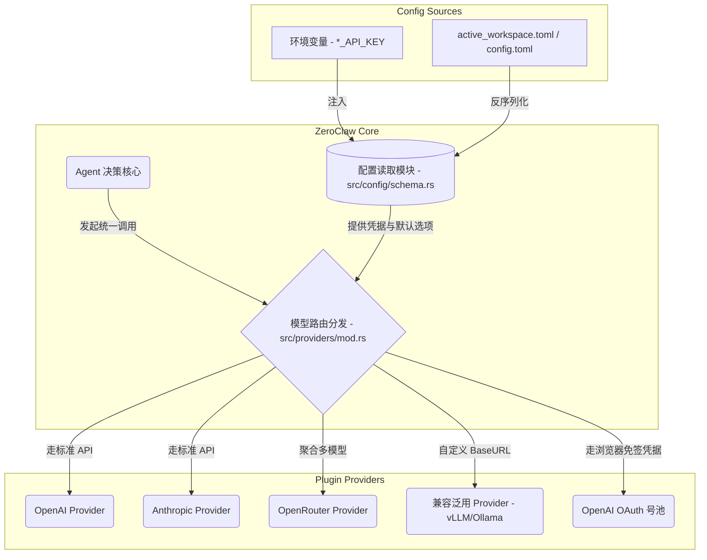
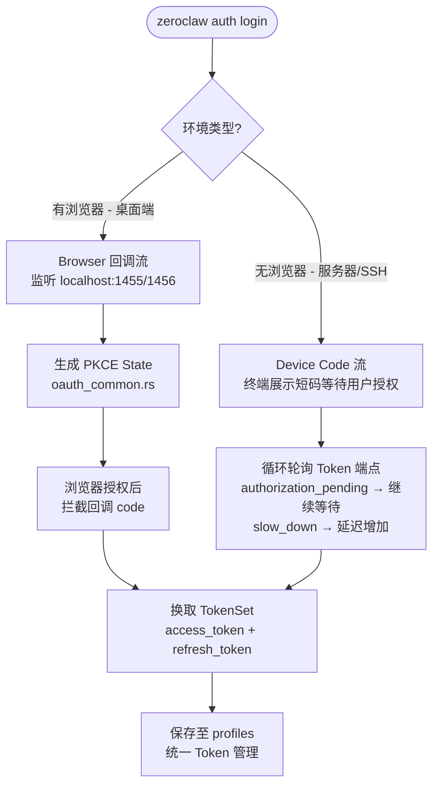

# 4. 大模型接入层与配置池 (Providers & Config)

ZeroClaw 的大模型（LLM）接入层采用了**基于 Trait 的插件化架构**。这使得无论是云端 API 还是本地大模型，都能以统一的接口（如流式返回、Function Calling）接入系统核心引擎。

相关源码位置：`src/providers/` 和配置层 `src/config/schema.rs`。

---

## 4.1 支持的 LLM 厂商概览

ZeroClaw 原生支持众多主流模型厂商（在 `src/providers/mod.rs` 中进行路由和工厂注册）：

*   **国际主流平台**:
    *   OpenAI (`openai`, `openai_codex`)
    *   Anthropic Claude (`anthropic`)
    *   Google Gemini (`gemini`)
    *   AWS Bedrock (`bedrock`)
    *   OpenRouter (`openrouter` - ZeroClaw 默认的路由提供商)
    *   GitHub Copilot (`copilot`)
*   **本地部署模型**:
    *   Ollama (`ollama`)
*   **国内大语言模型集成** (内置了完整的别名解析机制):
    *   阿里通义千问 (`qwen`, `dashscope`)
    *   智谱 GLM (`glm`, `zhipu`)
    *   月之暗面 Kimi (`moonshot`, `kimi`)
    *   MiniMax (`minimax`)
    *   字节豆包 (`doubao`, `ark`)
*   **通用协议兼容 (`compatible` 模块)**:
    *   只要提供并兼容 OpenAI `/v1/chat/completions` API 的任何推理框架（如 vLLM, LM Studio 等），都可以通过该模块无缝接入。

---

## 4.2 LLM 的灵活配置体系

ZeroClaw 采用了声明式配置以及 12Factor 环境变量双重支持。
以下是 ZeroClaw 接入层与配置系统的架构关系统系图：



### A. 配置文件 `config.toml`（推荐方式）
通常位于工作区根目录的 `active_workspace.toml` 或主目录下的 `~/.zeroclaw/config.toml`。

**全局基础配置示例：**
```toml
default_provider = "openrouter"
model = "anthropic/claude-3-5-sonnet"
api_key = "sk-xxxxxx" 
api_url = "https://openrouter.ai/api/v1" # 用于覆盖默认的 Base URL 或内网地址
default_temperature = 0.7
```

**多模型路由与自定义 Profile：**
通过 `model_providers` 块，可以为一个复杂的 Agent 系统定义成百上千个独立的接入配置（例如路由给专门的 Coding Agent 和普通的 Chat Agent 用不同的配置）：
```toml
[model_providers.my_local_llama]
name = "compatible" 
base_url = "http://127.0.0.1:11434/v1"
```

### B. 环境变量 (Env Vars)
支持各厂商的标准环境变量（例如 `OPENAI_API_KEY`, `ANTHROPIC_API_KEY`）以及 ZeroClaw 统一的 `ZEROCLAW_API_KEY`，极大地简化了 Docker 镜像和容器云的无状态注入。

---

## 4.3 官方 OAuth 认证基础设施 (`src/auth/`)

> [!NOTE]
> 本节内容为**官方上游正式支持的功能**，对应 `src/auth/` 目录下的三个模块。

随着 ZeroClaw 的发展，官方在 `src/auth/` 目录下建立了一套完整的 OAuth 认证基础框架，目前支持两大主流平台（OpenAI 和 Google/Gemini）的无 API Key 订阅账号接入。

### 4.3.1 统一 OAuth 工具层 (`src/auth/oauth_common.rs`)

该模块是 OpenAI 和 Gemini 两套 OAuth 实现的共用底座，提供：

- **PKCE 状态生成 (`generate_pkce_state`)**: 生成符合 RFC7636 规范的 `code_verifier`、`code_challenge`（SHA-256）和随机 `state`，防止授权码拦截攻击。
- **URL 编解码工具**: `url_encode` / `url_decode`，用于构造授权 URL 参数。
- **URL 截断检测 (`detect_url_truncation`)**: 当用户手动复制回调 URL 时，智能判断 URL 是否被截断并给出提示，引导用户改为只复制授权码。

### 4.3.2 OpenAI OAuth 双模式授权 (`src/auth/openai_oauth.rs`)

支持两种授权模式，适应不同使用环境：

**模式一：Browser 回调流（桌面端推荐）**
1. 构造带 PKCE 的 OpenAI 授权 URL（`build_authorize_url`）
2. 自动打开浏览器，监听本地 `127.0.0.1:1455` 回调端口（`receive_loopback_code`）
3. 浏览器授权成功后拦截回调 code，换取 Token（`exchange_code_for_tokens`）

**模式二：Device Code 流（服务器/无头环境推荐）**
1. 从 `https://auth.openai.com/oauth/device/code` 获取 `user_code` 和 `device_code` (`start_device_code_flow`)
2. 在终端展示短码（如 `ABCD-1234`），引导用户在任意设备浏览器完成授权
3. 程序自动轮询 Token 端点，处理 `authorization_pending` / `slow_down` 状态（`poll_device_code_tokens`）

两种模式均支持 **Token 自动刷新** (`refresh_access_token`)，所有 Token 统一通过 `TokenSet` 结构体管理。

### 4.3.3 Gemini OAuth 双模式授权 (`src/auth/gemini_oauth.rs`)

与 OpenAI 流程对称，面向 Google Cloud Platform（`cloud-platform` scope）：

- **凭据配置**：通过 `GEMINI_OAUTH_CLIENT_ID` 和 `GEMINI_OAUTH_CLIENT_SECRET` 环境变量注入（与 Gemini CLI 共用同一套 Client 凭据）
- **回调端口**：`127.0.0.1:1456`（与 OpenAI 的 1455 错开，可同时运行互不干扰）
- **兜底双模式输入**：`receive_loopback_code` 函数内置了 `tokio::select!` 逻辑，同时监听**浏览器回调** 和 **stdin 手动输入**，若回调超时则自动降级为终端粘贴模式
- **Cloudflare 防护检测**：Device Code 流内置了对 403 + Cloudflare 响应的特殊检测，服务器环境触发时主动给出切换到 Browser 流的建议



