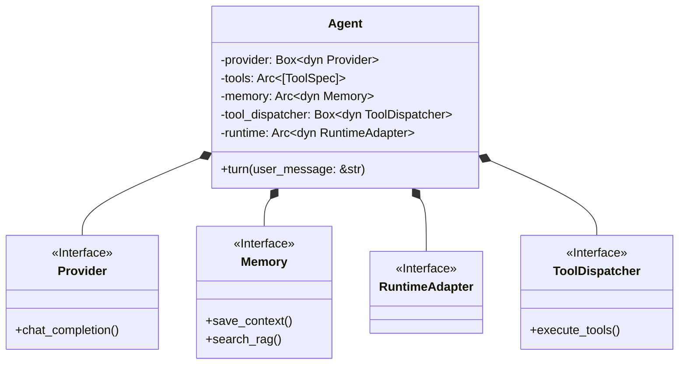
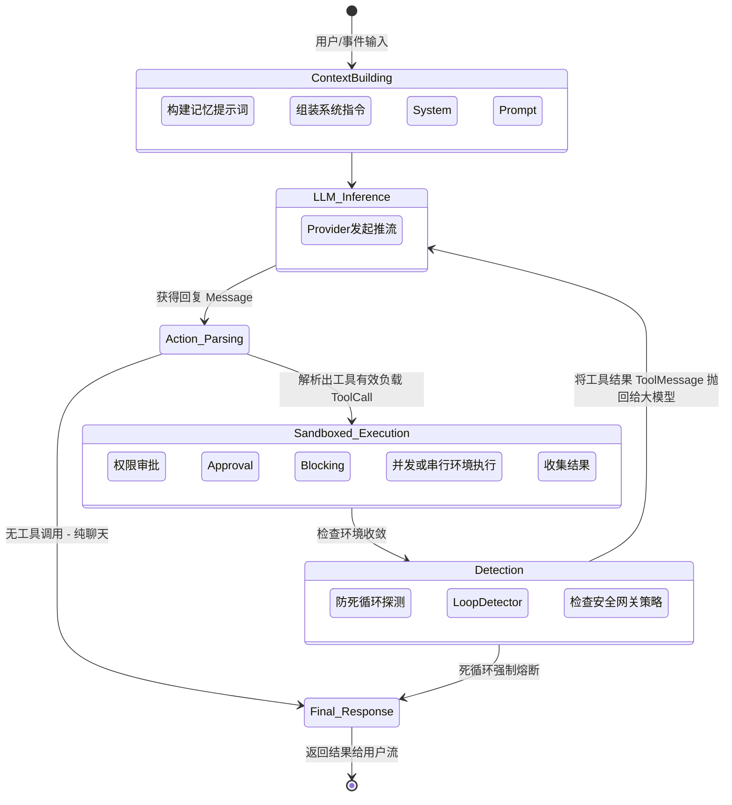

# 5. 核心执行引擎层 (Core Agent Engine)

ZeroClaw 的核心执行引擎位于 `src/agent/` 与 `src/runtime/` 目录下。它是整个 AI 自治系统的“大脑”与“心脏”，负责协调模型对话、工具调度、记忆存取以及运行环境适配。

ZeroClaw 在设计上贯彻了 **零开销 (Zero overhead) 与 极度抽象 (Trait-driven architecture)** 的理念。这意味着 Agent 的大脑是纯粹独立于外部环境的，它可以被静态编译并以不到 5MB 的极低资源占用运行在任何平台上。

---

## 5.1 Runtime 运行时抽象层 (`src/runtime/traits.rs`)

在阅读 `agent` 模块之前，必须先了解赋予 ZeroClaw “跨终端运行”能力的源泉：`RuntimeAdapter`。

在很多 Python 写的 AI 框架（如 AutoGPT）中，Agent 如果要执行 Shell 命令或读取文件，通常直接调用 `os.system` 或标准文件库。这种硬编码导致这些 Agent 极难移植到 Serverless 函数、Docker 隔离沙箱或 WebAssembly (Wasm) 环境中。

ZeroClaw 通过 `RuntimeAdapter` Trait 彻底解耦了这一强依赖：

```rust
pub trait RuntimeAdapter: Send + Sync {
    fn name(&self) -> &str;
    
    // 能力探针 (Capabilities)
    fn has_shell_access(&self) -> bool;
    fn has_filesystem_access(&self) -> bool;
    fn supports_long_running(&self) -> bool;
    
    // 环境挂载点与资源配额
    fn storage_path(&self) -> std::path::PathBuf;
    fn memory_budget(&self) -> u64; 

    // 沙箱化命令抽象
    fn build_shell_command(&self, command: &str, workspace_dir: &Path) -> anyhow::Result<tokio::process::Command>;
}
```

**应用场景：**
1. **`native`**: 桌面端或服务器裸机运行，开放所有权限。
2. **`docker`**: 代码在容器内执行，`build_shell_command` 可以被注入 `docker exec` 或限定的挂载目录限制。
3. **`wasm`**: 浏览器端或边缘节点运行，`has_shell_access()` 显式返回 `false`。Agent 核心在感知到此标志后，会**自动屏蔽系统级的本地 Tool**（如执行 Bash），避免在不受支持的环境崩溃。

---

## 5.2 Agent 顶层聚合状态构建 (`src/agent/agent.rs`)

`Agent` 结构体是将四面八方的抽象能力（Provider、Memory、ToolDispatcher 等）凝结在一起的关键控制器。
它使用了典型的建造者模式（Builder Pattern）：`AgentBuilder`。



如上图所示，Agent 自身没有任何绑定死的技术栈栈（如特定的数据库，或特定的 LLM API）。它通过持有这些 Trait 对象在运行时动态完成业务：将输入喂给 `Provider`，将结果交由 `ToolDispatcher` 路由，并用 `Memory` 持久化。

---

## 5.3 核心状态与思维主循环 (`src/agent/loop_.rs`)

当用户输入一句话或者一个触发事件传来，Agent 就进入了它的**心脏跳动阶段**——`turn` 方法背后的主循环 (`run_tool_call_loop`)。

由于大模型天生只能进行“一次性补全”，而我们在 Agent 编排中需要的是“思考 -> 行动 -> 观察结果 -> 再思考”的无限循环逻辑。`loop_.rs` 中通过 Rust 异步循环构建了这样一个健壮的自动化流水线引擎：



### 循环中的重难点与高级特性：

#### 1. 紧凑上下文管理 (Compact Context)与超长截断处理
如果是低显存机器运行的本地小模型，或者是为了省钱，引擎中内置了上下文裁切策略。
同时，如果大模型的回答超过了设定的 `max_tokens` 并被截断，循环引擎内部设置了 `MAX_TOKENS_CONTINUATION_MAX_ATTEMPTS = 3` 的延续机制：
此时引擎会自动注入一条内置系统级 Prompt：“*Previous response was truncated by token limit. Continue exactly from where you left off...*”，并把续写的结果进行在内存里的无缝拼接，对用户完全透明。

#### 2. 工具调度的并发与串行 (Execution Mode)
在获取到一连串多个工具调用（例如：同时搜索 3 个关键词）时：
* 如果引擎发现这些 Tool 不存在依赖和互斥，`execute_tools_parallel` 会使用 `tokio::spawn` 拉起异步并发任务提速。
* 如果带有 IO 会话（如下达 Shell 命令改变了系统状态），则自动降级为串行同步执行以保护时序安全。

#### 3. 拦截与防死循环网关 (Loop Detector)
大型 LLM 非常容易陷入“调用错误工具 -> 获得错误提示 -> 再次用同样的参数调用错误工具” 的死循环漩涡，白白消耗大量 API 费用。
`detection.rs` 维护了一个 `LoopDetector`。它在每次循环时审查最近 Action 的签名散列值。如果判定同一动作连续翻车超出阈值，系统会通过安全策略层强行 `Force Stop` 并抛出错误报告中断执行（`DetectionVerdict`），阻止灾难。

---

> **下一章预告：** 
> 离开了 Agent 的主脑控制层，我们需要解决的是 Agent “断电断网”之后如何记住曾经发生的事。下一章，我们将剖析支撑以上上下文轮转的核心子系统——**Chapter 6. 全量记忆体与检索引擎 (Memory & RAG)**。
