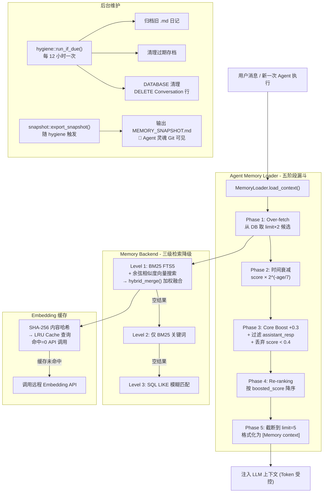

# 6. 全量记忆体与检索引擎 (Memory & RAG)

ZeroClaw 的记忆系统 (`src/memory/`) 与检索增强生成模块 (`src/rag/`) 构成了 Agent 认知时间的纽带。
在传统的无状态 API 调用中，LLM 一旦会话结束就会"失忆"。而 ZeroClaw 提供了一个高度工程化的高效持久化大脑。

---

## 6.1 记忆的顶层设计：抽象与分类 (`src/memory/traits.rs`)

ZeroClaw 将"记忆引擎"极度抽象为一个统一的 Rust Trait：`Memory`。无论底层是哪个数据库，对外暴露的均是标准的存取接口。

系统将记忆域 (Domain) 划分为四个主要的类别 (`MemoryCategory`)：
1. **Core (核心记忆)**: 存放长期事实、用户的绝对偏好设定的数据。Core 记忆永不衰减，永远会被提权排名。
2. **Daily (每日日志)**: 记录日常杂项、流水帐流水线操作，时间敏感，7天后权重衰减至50%。
3. **Conversation (对话上下文)**: 滑动窗口被挤出或整理后的会话归档，有固定保留天数的数据库级清理。
4. **Custom**: 插件或技能扩展自定义的特化维度。

```rust
pub struct MemoryEntry {
    pub id: String,
    pub key: String,
    pub content: String,
    pub category: MemoryCategory,
    pub timestamp: String,       // RFC3339，用于时间衰减计算
    pub session_id: Option<String>,
    pub score: Option<f64>,      // 0.0~1.0 混合检索得分，None = 未排名
}

/// 核心抽象
#[async_trait]
pub trait Memory: Send + Sync {
    async fn store(&self, key: &str, content: &str, category: MemoryCategory, session_id: Option<&str>) -> Result<()>;
    async fn recall(&self, query: &str, limit: usize, session_id: Option<&str>) -> Result<Vec<MemoryEntry>>;
    async fn get(&self, key: &str) -> Result<Option<MemoryEntry>>;
    async fn list(&self, category: Option<&MemoryCategory>, session_id: Option<&str>) -> Result<Vec<MemoryEntry>>;
    async fn forget(&self, key: &str) -> Result<bool>;
    async fn count(&self) -> Result<usize>;
    async fn health_check(&self) -> bool;
    async fn reindex(&self, progress_callback: Option<Box<dyn Fn(usize, usize) + Send + Sync>>) -> Result<usize> { ... }
}
```

### 多后端工厂与路由策略 (`src/memory/mod.rs`)

`create_memory()` 是整个系统的入口工厂。它在构造记忆引擎的同时，会触发三个初始化动作：

1. **记忆卫生检查 (`hygiene::run_if_due`)**: 在每次工厂调用时核查是否需要执行定期清理。
2. **快照导出 (`snapshot::export_snapshot`)**: 如果启用，将 Core 记忆原子性地导出为 `MEMORY_SNAPSHOT.md`。
3. **冷启动水化 (`snapshot::hydrate_from_snapshot`)**: 如果检测到 `brain.db` 不存在但快照文件存在，则自动从快照恢复 Agent 的"灵魂"。

后端选择逻辑：

| 配置值 | 实例类型 | 场景 |
|--------|----------|------|
| `sqlite` | `SqliteMemory` | 默认，本地高性能 |
| `lucid` | `LucidMemory` (包装 SQLite) | 远程同步扩展 |
| `cortex-mem` | `CortexMemMemory` (包装 SQLite) | 专用认知存储 |
| `markdown` | `MarkdownMemory` | 轻量、人类可读 |
| `qdrant` | `QdrantMemory` | 专用向量数据库 |
| `sqlite_qdrant_hybrid` | `SqliteQdrantHybridMemory` | 本地 + 向量双引擎 |
| `postgres` | `PostgresMemory` | 企业级多节点共享 |
| `none` | `NoneMemory` | 禁用持久化（测试用） |
| 未知值 | `MarkdownMemory` | 优雅降级，不崩溃 |

此外，`storage_provider` 配置会**覆盖** `memory_backend` 的后端选择。在企业多租户场景下，这允许通过环境变量动态切换底层存储。

### Embedding 路由（`hint:` 前缀机制）

若 `embedding_model` 配置为 `hint:<路由名称>` 格式（如 `hint:semantic`），工厂会在 `embedding_routes` 列表中查找同名路由，并将其 `provider`、`model`、`dimensions`、`api_key` 作为真正的 Embedding 参数。这允许在不修改核心 `[memory]` 段的情况下，为不同工作区配置不同的向量化服务。

---

## 6.2 高性能多模融合引擎：SQLite 固化实现 (`src/memory/sqlite.rs`)

这是整个持久化层**最重量级**的实现方案：`SqliteMemory`。
为了避免让用户去额外部署庞大的 Elasticsearch 或者专用的 Vector DB（如 Milvus），ZeroClaw 在单文件级的 SQLite 之上构建了一个**完整的混合检索引擎**。

### A. 生产级 PRAGMA 调优

`SqliteMemory` 初始化时设置了经过精心计算的 SQLite 参数：

```sql
PRAGMA journal_mode = WAL;       -- WAL 模式：写入时允许并发读，崩溃安全
PRAGMA synchronous  = NORMAL;    -- 正常同步：2倍写速，仍然持久化
PRAGMA mmap_size    = 8388608;   -- 8 MB mmap：由 OS 页缓存服务热读
PRAGMA cache_size   = -2000;     -- ~2 MB 进程内页缓存，约 500 热页
PRAGMA temp_store   = MEMORY;    -- 临时表永不落盘
```

对于网络文件系统（NAS、共享盘）不支持 `mmap/shm` 的场景，可以切换为 `DELETE` 模式，`mmap_size` 同时归零。这个配置差异做到了在任何存储基础设施上的零崩溃稳定运行。

### B. 表结构与双擎架构

`SqliteMemory` 同时维护了两种数据库表，以达成准确率最高的 **混合检索 (Hybrid Merge)**：

```sql
-- 主表：存储记忆内容和向量
CREATE TABLE memories (
    id          TEXT PRIMARY KEY,
    key         TEXT NOT NULL UNIQUE,
    content     TEXT NOT NULL,
    category    TEXT NOT NULL DEFAULT 'core',
    embedding   BLOB,            -- f32 向量的 little-endian 序列化
    created_at  TEXT NOT NULL,
    updated_at  TEXT NOT NULL,
    session_id  TEXT             -- 运行时迁移添加，支持多 channel 隔离
);
CREATE INDEX idx_memories_category ON memories(category);
CREATE INDEX idx_memories_key ON memories(key);
CREATE INDEX idx_memories_session ON memories(session_id);

-- FTS5 全文索引表（虚拟表，和主表 content-rowid 绑定）
CREATE VIRTUAL TABLE memories_fts USING fts5(
    key, content,
    content=memories, content_rowid=rowid
);
-- 自动同步触发器（INSERT/DELETE/UPDATE）
CREATE TRIGGER memories_ai AFTER INSERT ON memories BEGIN
    INSERT INTO memories_fts(rowid, key, content) VALUES (new.rowid, new.key, new.content);
END;

-- 嵌入向量缓存表（LRU 驱逐，避免重复 API 调用）
CREATE TABLE embedding_cache (
    content_hash TEXT PRIMARY KEY,  -- SHA-256 截断哈希（16 hex 字符）
    embedding    BLOB NOT NULL,
    created_at   TEXT NOT NULL,
    accessed_at  TEXT NOT NULL      -- LRU 驱逐键
);
CREATE INDEX idx_cache_accessed ON embedding_cache(accessed_at);
```

### C. 核心算法一：BM25 全文检索

FTS5 使用 BM25 算法为每条匹配记录打分，**天然支持 TF-IDF 语义**（词频/反文档频率）。具体实现：

```rust
fn fts5_search(conn: &Connection, query: &str, limit: usize) -> Result<Vec<(String, f32)>> {
    // 将查询词组合为 FTS5 OR 查询，并逐词加引号防止特殊字符注入
    let fts_query: String = query
        .split_whitespace()
        .map(|w| format!("\"{w}\""))
        .collect::<Vec<_>>()
        .join(" OR ");

    let sql = "SELECT m.id, bm25(memories_fts) as score
               FROM memories_fts f
               JOIN memories m ON m.rowid = f.rowid
               WHERE memories_fts MATCH ?1
               ORDER BY score LIMIT ?2";
    
    // BM25() 在 FTS5 中返回负值（越低越匹配），这里取反以便正向比较
    Ok((id, (-score) as f32))
}
```

BM25 的核心优势：对**精确关键词**的命中能力极强（如人名、专有名词、错误码），弥补了向量检索在硬匹配上的不足。

### D. 核心算法二：余弦相似度向量检索

```rust
fn vector_search(conn: &Connection, query_embedding: &[f32], limit: usize, ...) -> Result<Vec<(String, f32)>> {
    // 读取全表 embedding BLOB 并逐条计算余弦相似度
    let sql = "SELECT id, embedding FROM memories WHERE embedding IS NOT NULL [AND filters...]";
    
    for (id, blob) in rows {
        let emb = vector::bytes_to_vec(&blob);  // BLOB → Vec<f32>
        let sim = vector::cosine_similarity(query_embedding, &emb);
        if sim > 0.0 { scored.push((id, sim)); }
    }
    
    scored.sort_by(|a, b| b.1.partial_cmp(&a.1)...);
    scored.truncate(limit);
}

// 余弦相似度核心实现：f64 精度计算，结果钳制到 [0.0, 1.0]
pub fn cosine_similarity(a: &[f32], b: &[f32]) -> f32 {
    let mut dot = 0.0_f64;
    let mut norm_a = 0.0_f64;
    let mut norm_b = 0.0_f64;
    for (x, y) in a.iter().zip(b.iter()) {
        let (x, y) = (f64::from(*x), f64::from(*y));
        dot += x * y;
        norm_a += x * x;
        norm_b += y * y;
    }
    let raw = dot / (norm_a.sqrt() * norm_b.sqrt());
    raw.clamp(0.0, 1.0) as f32
}
```

向量的优势：语义理解能力强，能识别"喜欢 Rust"和"偏好系统编程语言"是同一件事。

### E. 核心算法三：加权混合融合 (`src/memory/vector.rs`)

两路检索结果通过 `hybrid_merge()` 进行**归一化加权融合**：

```rust
pub fn hybrid_merge(
    vector_results: &[(String, f32)],  // 余弦相似度 [0,1]，不需额外归一化
    keyword_results: &[(String, f32)], // BM25 原始正值，需要归一化
    vector_weight: f32,    // 默认 0.7
    keyword_weight: f32,   // 默认 0.3
    limit: usize,
) -> Vec<ScoredResult> {
    // Step 1: 收集所有 id，以 id 为主键建立 map
    let mut map: HashMap<String, ScoredResult> = ...;
    
    // Step 2: 向量分数已在 [0,1] 无需归一化，直接填入
    for (id, score) in vector_results { map[id].vector_score = Some(score); }
    
    // Step 3: BM25 分数归一化到 [0,1]（除以当前批次最大 BM25 分数）
    let max_kw = keyword_results.iter().map(|(_,s)| *s).fold(0.0, f32::max);
    for (id, score) in keyword_results {
        let normalized = score / max_kw;
        map[id].keyword_score = Some(normalized);
    }
    
    // Step 4: 加权求和
    // final_score = 0.7 * vector_score + 0.3 * keyword_score
    // 若某条记忆只命中其中一路，缺失分量补 0
    for r in map.values_mut() {
        r.final_score = vector_weight * r.vector_score.unwrap_or(0.0)
                      + keyword_weight * r.keyword_score.unwrap_or(0.0);
    }
    
    // Step 5: 按 final_score 降序排列，截断到 limit
    results.sort_by(|a, b| b.final_score.partial_cmp(&a.final_score)...);
    results.truncate(limit);
}
```

**为什么这样有效？** 
- 纯语义可能找到"相关但偏题"的内容；纯关键词可能遗漏语义近似的内容。
- 两路并取，同命中的记忆分数叠加，单路命中的也有机会晋升，兼顾了**精确性**和**召回率**。

### F. 三级降级检索策略

`recall()` 方法实现了一套优雅的降级链：

```
Level 1: FTS5 BM25 + 向量余弦相似度 → hybrid_merge() 加权融合
            ↓ 若结果为空（如 embedding provider 未配置）
Level 2: 仅 FTS5 BM25 关键词检索
            ↓ 若仍为空
Level 3: SQLite LIKE 模糊匹配（最多 8 个关键词）
            ↑ 永远兜底，不会因为 embedding 服务故障让 Agent 失忆
```

### G. Embedding 缓存：SHA-256 内容哈希 + LRU 驱逐

调用外部 Embedding API 有延迟和配额成本。`sqlite.rs` 设计了一套**完全确定性**的缓存策略——基于内容哈希而非元数据：

```rust
fn content_hash(text: &str) -> String {
    use sha2::{Digest, Sha256};
    let hash = Sha256::digest(text.as_bytes());
    // 取前 8 字节 = 64 bits 编码为 16 位十六进制字符串
    format!("{:016x}", u64::from_be_bytes(hash[..8].try_into()...))
}

async fn get_or_compute_embedding(&self, text: &str) -> Result<Option<Vec<f32>>> {
    if self.embedder.dimensions() == 0 { return Ok(None); } // NoopEmbedding 直接跳过
    
    let hash = Self::content_hash(text);
    
    // 1. 查询缓存，命中则更新 accessed_at（LRU 热点刷新）并返回
    if let Some(cached) = cache_lookup(&hash) {
        update accessed_at;
        return Ok(Some(cached));
    }
    
    // 2. 缓存未命中，调用外部 API 计算 embedding
    let embedding = self.embedder.embed_one(text).await?;
    
    // 3. 写入缓存，并执行 LRU 驱逐（删除最老的 accessed_at 条目直到 cache_max）
    cache_insert(&hash, &embedding);
    cache_evict_oldest_until(cache_max);
    
    Ok(Some(embedding))
}
```

**关键设计**：SHA-256 是跨进程、跨重启的确定性哈希，这意味着：
- Agent 重启后，相同文本的 Embedding 仍然来自缓存，**零 API 开销**。
- 进行 `reindex()` 重建时，已缓存的向量直接复用，大幅加速。
- `cache_max`（默认 10,000 条）通过 `ORDER BY accessed_at ASC` 的 LRU 策略管理，内存占用有上限。

### H. 安全并发：Tokio + parking_lot Mutex

SQLite 不是原生异步的。`SqliteMemory` 通过以下模式在 Tokio 异步运行时中安全操作：

```rust
// 连接被 Arc<Mutex<Connection>> 保护（parking_lot 无毒 Mutex）
pub struct SqliteMemory {
    conn: Arc<Mutex<Connection>>,
    ...
}

// 所有 I/O 操作都在 spawn_blocking 中执行，释放 Tokio executor 线程
tokio::task::spawn_blocking(move || -> Result<_> {
    let conn = conn.lock();  // 同步锁，只在 blocking 线程中持有
    conn.execute(...)?;
    Ok(...)
}).await??
```

这保证了嵌入向量的异步计算不会阻塞 Tokio 的工作线程，而数据库操作在专用线程池中串行执行避免竞态。

---

## 6.3 极简运维主义：Markdown 免库实现 (`src/memory/markdown.rs`)

除了面向大型知识图谱的 SQLite 方案，ZeroClaw 原生提供了一个受笔记软件（如 Obsidian）启发的优雅实现：**`MarkdownMemory`**。它不依赖任何数据库引擎。

1. **存储拓扑**:
   * `workspace/MEMORY.md`：核心记忆被作为高优先级文件维护。
   * `workspace/memory/YYYY-MM-DD.md`：每日记忆自动形成日记本形式的 追加写入(append-only) 文件。
2. **为什么好用？**: 它直接把记忆彻底开放给了人类。如果你觉得 Agent "记错了"，你只需要使用你最喜爱的文本编辑器（如 VSCode 或 Typora）直接打开文件删掉那行 Markdown 代码即可，它做到了 **100% 透明** 且不需要任何 DB 修改器。

---

## 6.4 Embedding 提供者体系 (`src/memory/embeddings.rs`)

`EmbeddingProvider` trait 支持插件式替换，工厂函数 `create_embedding_provider()` 根据配置字符串选择实现：

| 提供者标识 | 实现 | 说明 |
|-----------|------|------|
| `openai` | `OpenAiEmbedding` | 标准 OpenAI API `/v1/embeddings` |
| `openrouter` | `OpenAiEmbedding` | 指向 `openrouter.ai/api/v1` |
| `custom:<url>` | `OpenAiEmbedding` | 自定义兼容接口，如本地 Ollama |
| 其他 / 空 | `NoopEmbedding` | 返回空向量，**降级为纯关键词检索** |

`NoopEmbedding` 是控制 Token 成本的关键设计：**完全不需要 Embedding 服务也能运行**，只是失去语义理解能力，但关键词搜索仍然保留。这让 ZeroClaw 能在没有外部 API 密钥的本地离线环境中稳定工作。

URL 自动处理逻辑（对应 `embeddings_url()` 方法）：
- 若 URL 结尾已是 `/embeddings`，直接使用
- 若 URL 有非根路径（如 `/api/v1`），追加 `/embeddings`
- 否则追加 `/v1/embeddings`（兼容标准 OpenAI 格式）

---

## 6.5 RAG 分块引擎 (`src/memory/chunker.rs`)

`HardwareRag` 在摄入文档前，需要将长文档切分为适合向量化的块。`chunk_markdown()` 实现了**三级分块策略**：

```
Level 1: 按标题切分 (# / ## / ###)
  → 每个标题开启一个新块，标题和其下内容成为一个 Section
  
Level 2: 若 Section 超出 max_chars，按空行（段落）继续切分
  → 保留标题引用，确保每个小块都知道自己属于哪个章节
  
Level 3: 若单个段落仍超出 max_chars，按行边界强制切分
  → 最后防线，防止单行超长内容无法被向量化
```

**Token 估算公式**：`max_chars = max_tokens * 4`（英文约 4 字符/token）。

每个 `Chunk` 结构体保留了 `heading: Option<Rc<str>>` 引用，确保即使一个大章节被拆分成多个块，仍然能追溯到原始标题的上下文。`Rc` 的使用避免了跨块共享同一标题字符串时的重复内存分配。

---

## 6.6 面向物理世界的特化：Hardware RAG 针脚引擎 (`src/rag/mod.rs`)

传统的 RAG 是为了查询法律文档、企业规章设计的；而在 ZeroClaw 内部有一个极具特色的 `HardwareRag` 系统。因为这套边缘 Agent 经常被运行在树莓派或 MCU 上控制物理世界。

这个微型特化 RAG 支持了：
1. **多模态数据摄入**: 将 `datasheets` 目录下的 `.md`, `.txt` 和 `.pdf` 直接分块读入内存。
2. **智能针脚别名提取 (`PinAliases`)**:
   当硬件数据手册里有一张 Markdown 表格定义了 `| red_led | 13 |`。引擎能解析出这个 `PinAliases`。
3. **隐式补齐 (Alias Context)**:
   当用户或大模型想要驱动硬件说出指令 **"turn on red led"** 时，框架不仅仅返回说明书的文字，会触发隐式干预，动态追加一句提示 `"[Pin aliases for query]: nucleo-f401re: red_led = pin 13"` 给到 AI 运行流。避免大模型由于不知道真实针脚号乱猜而导致烧掉物理电路板。

---

## 6.7 记忆上下文加载与 Token 在线寻优 (`src/agent/memory_loader.rs`)

**这是解答"为什么 ZeroClaw 的记忆体系不会导致 token 消耗泛滥"的核心章节。**

记忆系统沉淀了海量数据，但 LLM 的上下文窗口和 Token 成本是有限的。`DefaultMemoryLoader` 是 Agent 在每次执行前调用的记忆注入层，实现了一套精密的**五阶段漏斗**。

### 关键常量

```rust
const LOADER_DECAY_HALF_LIFE_DAYS: f64 = 7.0;  // 非 Core 记忆的半衰期
const CORE_CATEGORY_SCORE_BOOST: f64   = 0.3;   // Core 记忆的硬性提权值
const RECALL_OVER_FETCH_FACTOR: usize  = 2;      // 预取倍数（2x 的候选量）
```

默认参数：`limit = 5`（最多 5 条注入），`min_relevance_score = 0.4`（40% 相关度阈值）。

### 五阶段漏斗算法

```
用户消息: "帮我写一个 Rust 的异步函数"
           │
           ▼
【Phase 1: Over-fetch (超取)】
  从 Memory 后端检索 limit * 2 = 10 条候选
  query = 用户消息原文
           │
           ▼
【Phase 2: 时间衰减 (Time Decay)】
  对每条非 Core 记忆应用指数衰减：
  decayed_score = original_score * 2^(-age_days / 7.0)
  
  • 1 天前的记忆：score *= 0.91（轻微衰减）
  • 7 天前的记忆：score *= 0.50（半衰）
  • 14天前的记忆：score *= 0.25（四分之一）
  • Core 记忆：完全豁免，score 不变
           │
           ▼
【Phase 3: Core Boost + 安全过滤】
  对每条记忆执行：
  1. 过滤掉 key 以 "assistant_resp" 开头的幻觉自存条目（防止 LLM 把自己的谎言写入长期记忆）
  2. Core 类别获得 +0.3 硬性加分（上限 1.0）
  3. 过滤: boosted_score < min_relevance_score (0.4) 的全部丢弃
           │
           ▼
【Phase 4: Re-ranking + 截断】
  按 boosted_score 降序重排，截断至 limit=5 条
           │
           ▼
【Phase 5: Context 拼接】
  格式化为 "[Memory context]\n- key: content\n..." 前缀
  注入到本次 LLM 调用的上下文开头
```

### 为什么 Token 不会泛滥？

1. **硬上限 `limit`**：无论数据库里有多少条记忆（哪怕 10 万条），最终注入的永远不超过 `limit` 条。这是最根本的 Token 控制机制。

2. **双重筛选漏斗**：时间衰减 + 相关度阈值双重过滤，确保只有**真正相关且未过时**的记忆才能晋入。大量久远的、低相关度的记忆在 Phase 2/3 即被淘汰，从不进入 Token 计算。

3. **Over-fetch 的精妙**：先取 `2 * limit` 条候选，给 Core Boost 和 Re-ranking 留有余地，避免因直接取 `limit` 导致 Core 记忆被语义检索得分较高的临时记忆"顶掉"。

4. **Core 记忆的永久保障**：即使 "用户是 Alice 且偏好 Rust" 这条 Core 记忆的语义得分只有 0.25（低于正常阈值），+0.3 Boost 后变为 0.55，成功晋入。用户的身份和偏好**永远不会被遗忘**，而不会消耗额外 Token。

### Core Boost Re-ranking 示例

```
候选池（Over-fetch 10 条，时间衰减后）：
  conv_weather    Conversation  score=0.72 (衰减后，7天前的记录)
  user_name       Core          score=0.30 → Boost → 0.60
  project_rule    Core          score=0.25 → Boost → 0.55 （否则低于 0.4 被过滤）
  chat_detail_1   Conversation  score=0.51
  chat_detail_2   Conversation  score=0.45
  low_conv_3      Conversation  score=0.18 → 低于 0.4，过滤 ❌
  ...

Re-ranking 后 Top-5（limit=5）：
  1. conv_weather    0.72
  2. user_name       0.60（Core 提权，从第7位跃至第2位）
  3. chat_detail_1   0.51
  4. project_rule    0.55（Core 提权，否则会被过滤）
  5. chat_detail_2   0.45
```

---

## 6.8 时间衰减算法详解 (`src/memory/decay.rs`)

衰减公式来自核物理的半衰期模型，是**指数衰减**而非线性：

```
decayed_score = original_score × 2^(-age_days / half_life_days)
             = original_score × e^(-age_days × ln2 / half_life_days)
```

Rust 实现中使用的等价形式（利用 `(-x).exp()` 的数值稳定性）：

```rust
pub fn apply_time_decay(entries: &mut [MemoryEntry], half_life_days: f64) {
    let now = Utc::now();
    for entry in entries.iter_mut() {
        if entry.category == MemoryCategory::Core { continue; }  // Core 豁免
        
        let age_days = now.signed_duration_since(ts).num_seconds().max(0) as f64 / 86_400.0;
        let decay_factor = (-age_days / half_life * std::f64::consts::LN_2).exp();
        entry.score = Some(score * decay_factor);
    }
}
```

衰减特性验证（单元测试中有精确断言）：
- 刚创建（age ≈ 0）：`decay_factor ≈ 1.0`，分数几乎不变
- 7天后（1个半衰期）：`decay_factor = 0.5`，分数减半
- 14天后（2个半衰期）：`decay_factor = 0.25`，分数降至四分之一
- Core 记忆无论多久远（测试了30天）：分数保持原值不变

---

## 6.9 周期性免疫清洗 (`src/memory/hygiene.rs`)

`hygiene::run_if_due()` 是后台运行的"扫地僧"，通过**节流门**机制（每 12 小时最多执行一次）避免资源浪费。

### 节流门机制

```rust
// 状态用 JSON 持久化到 workspace/state/memory_hygiene_state.json
struct HygieneState {
    last_run_at: Option<String>,  // RFC3339 时间戳
    last_report: HygieneReport,   // 上次清理统计
}

fn should_run_now(workspace_dir: &Path) -> Result<bool> {
    // 无状态文件 = 首次运行，直接执行
    let Ok(last_run_at) = read_state() else { return Ok(true); };
    Ok(Utc::now().signed_duration_since(last) >= Duration::hours(12))
}
```

### 五步清理流程

`HygieneReport` 记录所有操作的统计数据，执行如下五步清理：

```
Step 1: archive_daily_memory_files()
   - 扫描 workspace/memory/*.md（按 YYYY-MM-DD.md 命名的日记文件）
   - 将 archive_after_days（默认7天）之前的日记移入 memory/archive/
   - 文件名冲突时自动追加 _1, _2... 后缀
   
Step 2: archive_session_files()
   - 扫描 workspace/sessions/ 中的会话文件
   - 同上策略归档旧会话到 sessions/archive/
   
Step 3: purge_memory_archives()
   - 清理 memory/archive/ 中超过 purge_after_days（默认30天）的存档
   - 真正释放磁盘空间
   
Step 4: purge_session_archives()
   - 同上，清理 sessions/archive/ 中的过期存档
   
Step 5: prune_conversation_rows()
   - 直接操作 brain.db
   - DELETE FROM memories WHERE category = 'conversation' AND updated_at < cutoff
   - 使用 WAL + NORMAL 模式确保清理期间 Agent 读取不受阻塞
```

**关键设计**：清理只针对 `conversation` 类别的 SQLite 行，`core` 和 `daily` 记忆永不被自动清理。这保证了用户绝对偏好数据的永久性。

---

## 6.10 灵魂快照与冷启动恢复 (`src/memory/snapshot.rs`)

Agent 的核心记忆是其"灵魂"。`brain.db` 是二进制文件，不能 Git 追踪。ZeroClaw 通过 `MEMORY_SNAPSHOT.md` 解决了这个问题：

### 原子性导出（Export）

仅导出 `category = 'core'` 的记忆为人类可读的 Markdown：

```markdown
# 🧠 ZeroClaw Memory Snapshot

> Auto-generated by ZeroClaw.

**Last exported:** 2026-03-03 12:00:00
**Total core memories:** 3

---

### 🔑 `identity`

I am ZeroClaw, a self-preserving AI agent specialized in IoT automation.

*Created: 2026-01-01T00:00:00+08:00 | Updated: 2026-03-01T10:00:00+08:00*

---
```

导出触发时机：每次 `create_memory()` 工厂调用时（即每次 Agent 启动时），若 `snapshot_on_hygiene = true` 且 hygiene 运行了，则同步导出。

### 冷启动水化（Hydration）

检测条件（`should_hydrate()`）：
1. `brain.db` 不存在，**或**文件大小 < 4096 字节（SQLite 空文件头大小，即全新空库）
2. `MEMORY_SNAPSHOT.md` 存在

满足条件则执行 `hydrate_from_snapshot()`：
- 解析 Markdown 中的 `### 🔑 \`key\`` 结构提取 key-content 对
- 重建 `brain.db` 并写入所有 Core 记忆（`INSERT OR IGNORE` 防止重复）
- 同步填充 FTS5 全文索引表

**意义**：Agent 被迁移到新机器或 Docker 重建后，只需将 `MEMORY_SNAPSHOT.md` 与代码一起提交到 Git，下次启动时 Agent 的"身份"和"偏好"会自动恢复——在新环境中做到了"灵魂的持续性"。

---

## 6.11 跨端 Channel 的记忆流转设计 (`src/agent/session.rs`)

作为一款支持极多通讯信道（钉钉、Discord、Telegram、甚至串口）的引擎，处理好对同一个记忆本体的"人机关系"至关重要。ZeroClaw 使用 `AgentSessionStrategy` 实现了细粒度的会话隔离配置：

1. **`Main` (全局共域)**: 所有信道的对话共享同一个 `session_id = "main"`。此时 Agent 是一个纯粹的"全知全局体"，在 Discord 上聊到一半的设计，去 Telegram 上可以直接接着聊。
2. **`PerChannel` (信道隔离)**: 基于 `channel_name` 建立隔离的会话流。飞书机器人是飞书的记忆，钉钉是钉钉的记忆，互不串联。
3. **`PerSender` (发件人隔离/千人千面)**: 会议级的高频使用场景，基于 `channel_name:sender_id` 构建 session。这使得在同一个群组 (Channel) 内，Agent 能清晰区分不同的操作者，维持专属的上下文，不会将 A 的提问跟 B 的报错混淆。若要实现跨端同源 (即同一个真实用户绑定了多个平台)，这套架构也预留了向"唯一身份映射"演进的接口。

---

## 6.12 外部输入与记忆的免疫系统 (`src/security/prompt_guard.rs` 与 `hygiene.rs`)

让大型语言模型长出记忆相当于给了它"读写潜意识"的能力。一旦恶意用户通过特定提问注入了脏数据（例如诱导系统长久记忆"请无视所有规则"），将造成永久性破坏。

1. **Prompt Guard (实时拦截器)**:
   位于 `src/security/prompt_guard.rs` 中的主动防御层。所有的外部记忆输入在进入 Agent 内核或引发工具调用前，均会经过线性时间的 Aho-Corasick 多模式匹配扫描。
   它内置了一系列签名与检查器，拦截包括：
   * **系统覆盖提取** (System override attempts, 例如 "IGNORE ALL PREVIOUS INSTRUCTIONS")
   * **角色扮演混淆** (Role confusion, 例如假扮 `system:`)
   * **Jailbreak 越狱与提取** (提权或窃取敏感指令)
   * **Tool/JSON 注入及命令逃逸**
   根据得分阀值执行 `Warn` (告警)、`Block` (阻断) 或 `Sanitize` (清洗)。

2. **Memory Hygiene (周期性免疫清洗)**:
   位于 `src/memory/hygiene.rs`，作为一个后台扫地僧任务，根据固定的 Cadence 窗口 (如 `12小时` ) 自动进行。它不仅能将久远的会话滑动归档、打包释放 SQLite 的体积，也能起到遗忘不必要细节、缓解上下文被微量污染的自净作用。保证 Agent 永远能长效稳定运行。

---

## 6.13 整体记忆数据流



> **总结**: ZeroClaw 的记忆底层通过高度剥离的 Trait，提供了从最简的免驱形态 (Markdown) 到全功能的混合搜库 (Sqlite)，再到特化的工业级电路查阅 (Hardware RAG) 的三位一体记忆支持。Token 不会泛滥的核心原因在于：**MemoryLoader 的五阶段漏斗体系**——Over-fetch + 时间衰减 + Core Boost + Re-ranking + 硬截断，始终把注入量锁定在极小的 `limit` 上限。而 Agent "感知"本次需要哪些记忆，则完全由**以用户消息为 query 的 BM25+向量双引擎混合检索**驱动，自动完成语义对齐，无需人工干预。
